# Identity Platform Dependencies

## Status model

`proposed` means scoped but not authorized. `ready` means all start gates
are satisfied and one agent may claim the unit. `in-progress` has one owner.
`implemented-unverified` has implementation but incomplete release evidence.
Only `verified` satisfies a dependant. `blocked` records an explicit blocker.

```text
proposed -> ready -> in-progress -> implemented-unverified -> verified
                  \-> blocked -> ready
                  \-> ready (abandoned assignment, generation + 1)
implemented-unverified -> in-progress (same owner/branch repair)
implemented-unverified -> blocked -> in-progress (same assignment repair)
verified -> implemented-unverified (changed complete inputs)
```

A unit MUST NOT become `ready` unless all `Requires` units are `verified`.
It MUST return to `implemented-unverified` when changed complete inputs
invalidate its evidence.
An `in-progress` unit MAY return to `ready` only after the coordinator proves
no unintegrated package work is discarded and increments its generation. A
resolved pre-integration `blocked` unit MUST return to `ready` before
reassignment. A blocked integrated unit returns to `in-progress` with its same
assignment for repair. Repair of an integrated unit retains its assignment
identity and uses `implemented-unverified -> in-progress`; a replacement owner
requires a new generation. If a prerequisite loses verified status, every
transitive dependant whose complete input fingerprint changes MUST be demoted
and every active dependant on that stale baseline MUST transition to `blocked`
and pause until refreshed.

## Dependency DAG

```mermaid
flowchart TD
  session[identity/session]
  delivery[identity/delivery]
  risk[identity/risk]
  captcha[identity/risk/captcha]
  recaptcha[identity/risk/captcha/recaptcha]
  turnstile[identity/risk/captcha/turnstile]
  hcaptcha[identity/risk/captcha/hcaptcha]
  captchafox[identity/risk/captcha/captchafox]
  hibp[identity/risk/hibp]
  email[identity/email]
  password[identity/password]
  password_pg[identity/password/postgres]
  username[identity/username]
  magiclink[identity/magiclink]
  otp[identity/otp]
  otp_pg[identity/otp/postgres]
  phone[identity/phone]
  anonymous[identity/anonymous]
  mfa[identity/mfa]
  mfa_pg[identity/mfa/postgres]
  webauthn_pg[webauthn/postgres]
  oauth[identity/oauth]
  oauth_pg[identity/oauth/postgres]
  oauth_providers[identity/oauth/providers]
  oauth_onetap[identity/oauth/onetap]
  oauth_proxy[identity/oauth/proxy]
  apikey[identity/apikey]
  apikey_pg[identity/apikey/postgres]
  apikey_valkey[identity/apikey/valkey]
  impersonation[identity/impersonation]
  impersonation_pg[identity/impersonation/postgres]
  identity --> identity_pg[identity/postgres]
  identity --> session
  session --> session_pg[identity/session/postgres]
  identity_pg --> session_pg
  session --> session_valkey[identity/session/valkey]
  identity --> risk
  identity_pg --> risk_pg[identity/risk/postgres]
  risk --> risk_pg[identity/risk/postgres]
  risk --> risk_valkey[identity/risk/valkey]
  risk --> captcha
  captcha --> recaptcha
  captcha --> turnstile
  captcha --> hcaptcha
  captcha --> captchafox
  risk --> hibp
  identity --> email
  delivery --> email
  identity --> password
  session --> password
  risk --> password
  delivery --> password
  password --> password_pg
  identity_pg --> password_pg
  identity --> username
  password --> username
  email --> magiclink
  identity --> magiclink
  session --> magiclink
  risk --> magiclink
  identity --> otp
  delivery --> otp
  session --> otp
  risk --> otp
  otp --> otp_pg
  identity_pg --> otp_pg
  otp --> phone
  identity --> phone
  delivery --> phone
  identity --> anonymous
  session --> anonymous
  otp --> mfa
  identity --> mfa
  session --> mfa
  risk --> mfa
  webauthn --> mfa
  mfa --> mfa_pg
  identity_pg --> mfa_pg
  webauthn_pg --> mfa_pg
  webauthn --> webauthn_pg
  webauthn --> passkey
  identity --> passkey
  session --> passkey
  risk --> passkey
  passkey --> passkey_pg[passkey/postgres]
  identity_pg --> passkey_pg
  webauthn_pg --> passkey_pg
  identity --> oauth
  session --> oauth
  risk --> oauth
  oauth --> oauth_pg
  identity_pg --> oauth_pg
  oauth --> oauth_providers
  oauth --> oauth_onetap
  oauth_providers --> oauth_onetap
  oauth --> oauth_proxy
  identity --> apikey
  apikey --> apikey_pg
  identity_pg --> apikey_pg
  apikey --> apikey_valkey
  apikey_pg --> apikey_valkey
  identity --> impersonation
  session --> impersonation
  risk --> impersonation
  impersonation --> impersonation_pg
  identity_pg --> impersonation_pg
  session_pg --> impersonation_pg
  identity --> organization
  delivery --> organization
  organization --> organization_pg[organization/postgres]
  identity_pg --> organization_pg
  organization --> sso
  identity --> sso
  session --> sso
  risk --> sso
  sso --> sso_oidc[sso/oidc]
  sso --> sso_oauth2[sso/oauth2]
  sso --> sso_saml[sso/saml]
  sso --> sso_pg[sso/postgres]
  sso_oidc --> sso_pg
  sso_oauth2 --> sso_pg
  sso_saml --> sso_pg
  organization_pg --> sso_pg
  organization --> scim
  identity --> scim
  scim --> scim_pg[scim/postgres]
  organization_pg --> scim_pg
  scim --> scim_org[scim/organization]
  organization --> scim_org
  identity --> oauth_server[oauth-server]
  session --> oauth_server
  risk --> oauth_server
  oauth_server --> oauth_server_oidc[oauth-server/oidc]
  oauth_server --> oauth_server_device[oauth-server/device]
  oauth_server --> oauth_server_pg[oauth-server/postgres]
  oauth_server_device --> oauth_server_pg
  identity_pg --> oauth_server_pg
  session_pg --> oauth_server_pg
  identity --> i18n[identity/i18n]
  identity --> identity_http[identity/http]
  session --> identity_http
  delivery --> identity_http
  risk --> identity_http
  captcha --> identity_http
  password --> identity_http
  username --> identity_http
  email --> identity_http
  magiclink --> identity_http
  otp --> identity_http
  phone --> identity_http
  anonymous --> identity_http
  mfa --> identity_http
  webauthn --> identity_http
  passkey --> identity_http
  oauth --> identity_http
  oauth_providers --> identity_http
  oauth_onetap --> identity_http
  oauth_proxy --> identity_http
  apikey --> identity_http
  impersonation --> identity_http
  organization --> identity_http
  sso --> identity_http
  sso_oidc --> identity_http
  sso_oauth2 --> identity_http
  sso_saml --> identity_http
  scim --> identity_http
  scim_org --> identity_http
  oauth_server --> identity_http
  oauth_server_oidc --> identity_http
  oauth_server_device --> identity_http
  i18n --> identity_http
  identity_http --> reference[identity/reference]
  identity_pg --> reference
  session_pg --> reference
  session_valkey --> reference
  risk_pg --> reference
  risk_valkey --> reference
  recaptcha --> reference
  turnstile --> reference
  hcaptcha --> reference
  captchafox --> reference
  hibp --> reference
  password_pg --> reference
  otp_pg --> reference
  mfa_pg --> reference
  webauthn_pg --> reference
  passkey_pg --> reference
  oauth_pg --> reference
  apikey_pg --> reference
  apikey_valkey --> reference
  impersonation_pg --> reference
  organization_pg --> reference
  sso_pg --> reference
  scim_pg --> reference
  oauth_server_pg --> reference
  reference --> identitytest[identity/identitytest]
```



The `Requires` field in `INVENTORY.md` is authoritative. The diagram is
explanatory and MUST change in the same commit when an edge changes.
