# Identity Platform Dependencies

## Status model

`proposed` means scoped but not authorized. `ready` means all start gates
are satisfied and one agent may claim the unit. `in-progress` has one owner.
`implemented-unverified` has implementation but incomplete release evidence.
Only `verified` satisfies a dependant. `blocked` records an explicit blocker.

```text
proposed -> ready -> in-progress -> implemented-unverified -> verified
                  \-> blocked -> in-progress
```

A unit MUST NOT become `ready` unless all `Requires` units are `verified`.
It MUST return to `implemented-unverified` when changed complete inputs
invalidate its evidence.

## Dependency DAG

```mermaid
flowchart TD
  session[identity/session]
  delivery[identity/delivery]
  risk[identity/risk]
  captcha[identity/risk/captcha]
  recaptcha[identity/risk/captcha/recaptcha]
  turnstile[identity/risk/captcha/turnstile]
  email[identity/email]
  password[identity/password]
  magiclink[identity/magiclink]
  otp[identity/otp]
  phone[identity/phone]
  anonymous[identity/anonymous]
  mfa[identity/mfa]
  oauth[identity/oauth]
  apikey[identity/apikey]
  impersonation[identity/impersonation]
  identity --> identity_pg[identity/postgres]
  identity --> session
  session --> session_pg[identity/session/postgres]
  identity_pg --> session_pg
  session --> session_valkey[identity/session/valkey]
  identity --> risk
  identity_pg --> risk_pg[identity/risk/postgres]
  risk --> risk_pg[identity/risk/postgres]
  risk --> risk_valkey[identity/risk/valkey]
  risk --> captcha
  captcha --> recaptcha
  captcha --> turnstile
  identity --> email
  delivery --> email
  identity --> password
  session --> password
  risk --> password
  delivery --> password
  email --> magiclink
  identity --> magiclink
  session --> magiclink
  risk --> magiclink
  identity --> otp
  delivery --> otp
  session --> otp
  risk --> otp
  otp --> phone
  identity --> phone
  delivery --> phone
  identity --> anonymous
  session --> anonymous
  otp --> mfa
  identity --> mfa
  session --> mfa
  risk --> mfa
  webauthn --> passkey
  identity --> passkey
  session --> passkey
  risk --> passkey
  identity --> oauth
  session --> oauth
  risk --> oauth
  identity --> apikey
  identity --> impersonation
  session --> impersonation
  risk --> impersonation
  identity --> organization
  organization --> organization_pg[organization/postgres]
  identity_pg --> organization_pg
  organization --> sso
  identity --> sso
  session --> sso
  risk --> sso
  sso --> sso_oidc[sso/oidc]
  sso --> sso_oauth2[sso/oauth2]
  sso --> sso_saml[sso/saml]
  sso --> sso_pg[sso/postgres]
  organization_pg --> sso_pg
  organization --> scim
  identity --> scim
  scim --> scim_pg[scim/postgres]
  organization_pg --> scim_pg
  scim --> scim_org[scim/organization]
  organization --> scim_org
  identity --> oauth_server[oauth-server]
  session --> oauth_server
  risk --> oauth_server
  oauth_server --> oauth_server_oidc[oauth-server/oidc]
  oauth_server --> oauth_server_device[oauth-server/device]
  oauth_server --> oauth_server_pg[oauth-server/postgres]
  identity_pg --> oauth_server_pg
  session_pg --> oauth_server_pg
```



The `Requires` field in `INVENTORY.md` is authoritative. The diagram is
explanatory and MUST change in the same commit when an edge changes.
