# Identity Platform Dependencies

The key words "MUST", "MUST NOT", "REQUIRED", "SHALL", "SHALL NOT",
"SHOULD", "SHOULD NOT", "RECOMMENDED", "NOT RECOMMENDED", "MAY", and
"OPTIONAL" in this document are to be interpreted as described in BCP 14
[RFC2119] [RFC8174] when, and only when, they appear in all capitals, as
shown here.

## Status model

`proposed` means scoped but not authorized. `ready` means all start gates
are satisfied and one agent may claim the unit. `in-progress` has one owner.
`implemented-unverified` has integrated implementation but incomplete or stale
release evidence. Only `verified` satisfies a dependant. `blocked` is an
inventory execution state with an explicit safe blocker identifier; it is not
the coordinator agent's system goal status.

```text
proposed -> ready -> in-progress -> implemented-unverified -> verified
         <- ready (prerequisite invalidation; generation unchanged)
                  \-> blocked -> in-progress (same paused assignment)
                  \-> blocked -> ready (assignment abandoned, generation + 1)
                  \-> ready (abandoned assignment, generation + 1)
implemented-unverified -> in-progress (same owner/branch repair)
implemented-unverified -> blocked -> in-progress (same assignment repair)
verified -> implemented-unverified (changed complete inputs)
```

A unit MUST NOT become `ready` unless all `Requires` units are `verified`.
An unassigned `ready` unit MUST return to `proposed`, without changing its
generation or empty assignment/evidence fields, in the same coordinator commit
that invalidates any prerequisite. It becomes `ready` again only after every
start gate is current.
An initial `proposed` row MUST have generation `0`. A post-initial `proposed`
row retains the current generation, which remains `0` before any assignment and
may be greater than `0` after an assignment was abandoned. History validation
MUST prove its only incoming edge was `ready -> proposed` prerequisite
invalidation; no other status may return to `proposed`.
It MUST return to `implemented-unverified` when changed complete inputs
invalidate its evidence.
An `in-progress` unit MAY return to `ready` only after the coordinator proves
no unintegrated package work is discarded and increments its generation. A
`blocked` unit that retains its ledger assignment MAY return directly to
`in-progress` under that exact task, branch, worktree, and generation after its
blocker is resolved. For conflict or stale-baseline recovery, that transition
MUST be the coordinator resume/authorization commit. Its recovery row MUST pin
the commit's first-parent pre-resume integration baseline and the worker's clean
checkpoint; before any package edit the worker MUST merge that exact resume
commit and verify both ancestry relationships. A `blocked` unit whose
assignment is abandoned MUST return to `ready`, increment generation, clear
active assignment fields, and receive a new assignment before work resumes.
Repair of an integrated unit retains its
recorded assignment identity and uses `implemented-unverified -> in-progress`;
a replacement owner requires a new generation. If a prerequisite loses
verified status, every transitive dependant whose complete input fingerprint
changes MUST be demoted, every unassigned `ready` dependant MUST return to
`proposed`, and every active dependant on that stale baseline MUST transition
to inventory `blocked` and pause until refreshed.

For `proposed`, `ready`, `implemented-unverified`, and `verified`, the inventory
owner/blocker MUST be `—`. For `in-progress`, it MUST equal the recorded worker
task. For `blocked`, it MUST be a whitespace-free `blocker:<safe-id>` and the
ledger assignment fields determine whether the same assignment is retained.
Using inventory `blocked` does not call `update_goal`, does not count as a
system blocked turn, and does not authorize the coordinator to stop while other
safe work remains. The coordinator MAY report its own system goal as blocked
only under repository blocked-audit rules and the stop conditions in
`ORCHESTRATOR_GOAL.md`.

## Dependency DAG

```mermaid
flowchart TD
  session[identity/session]
  delivery[identity/delivery]
  delivery_pg[identity/delivery/postgres]
  risk[identity/risk]
  captcha[identity/risk/captcha]
  recaptcha[identity/risk/captcha/recaptcha]
  turnstile[identity/risk/captcha/turnstile]
  hcaptcha[identity/risk/captcha/hcaptcha]
  captchafox[identity/risk/captcha/captchafox]
  hibp[identity/risk/hibp]
  email[identity/email]
  password[identity/password]
  password_pg[identity/password/postgres]
  username[identity/username]
  magiclink[identity/magiclink]
  otp[identity/otp]
  otp_pg[identity/otp/postgres]
  phone[identity/phone]
  anonymous[identity/anonymous]
  anonymous_pg[identity/anonymous/postgres]
  mfa[identity/mfa]
  mfa_pg[identity/mfa/postgres]
  webauthn_pg[webauthn/postgres]
  oauth[identity/oauth]
  oauth_pg[identity/oauth/postgres]
  oauth_providers[identity/oauth/providers]
  oauth_onetap[identity/oauth/onetap]
  oauth_proxy[identity/oauth/proxy]
  apikey[identity/apikey]
  apikey_pg[identity/apikey/postgres]
  apikey_valkey[identity/apikey/valkey]
  impersonation[identity/impersonation]
  impersonation_pg[identity/impersonation/postgres]
  identity --> identity_pg[identity/postgres]
  identity --> session
  session --> session_pg[identity/session/postgres]
  identity_pg --> session_pg
  session --> session_valkey[identity/session/valkey]
  identity --> risk
  identity_pg --> risk_pg[identity/risk/postgres]
  risk --> risk_pg[identity/risk/postgres]
  risk --> risk_valkey[identity/risk/valkey]
  risk --> captcha
  captcha --> recaptcha
  captcha --> turnstile
  captcha --> hcaptcha
  captcha --> captchafox
  risk --> hibp
  identity --> email
  delivery --> email
  otp --> email
  delivery --> delivery_pg
  identity_pg --> delivery_pg
  identity --> password
  session --> password
  risk --> password
  delivery --> password
  password --> password_pg
  identity_pg --> password_pg
  identity --> username
  password --> username
  email --> magiclink
  identity --> magiclink
  session --> magiclink
  risk --> magiclink
  identity --> otp
  delivery --> otp
  session --> otp
  risk --> otp
  otp --> otp_pg
  identity_pg --> otp_pg
  otp --> phone
  identity --> phone
  delivery --> phone
  risk --> phone
  identity --> anonymous
  session --> anonymous
  risk --> anonymous
  anonymous --> anonymous_pg
  identity_pg --> anonymous_pg
  otp --> mfa
  identity --> mfa
  session --> mfa
  risk --> mfa
  webauthn --> mfa
  mfa --> mfa_pg
  identity_pg --> mfa_pg
  webauthn_pg --> mfa_pg
  webauthn --> webauthn_pg
  identity_pg --> webauthn_pg
  webauthn --> passkey
  identity --> passkey
  session --> passkey
  risk --> passkey
  passkey --> passkey_pg[passkey/postgres]
  identity_pg --> passkey_pg
  webauthn_pg --> passkey_pg
  identity --> oauth
  session --> oauth
  risk --> oauth
  oauth --> oauth_pg
  identity_pg --> oauth_pg
  oauth --> oauth_providers
  oauth --> oauth_onetap
  oauth_providers --> oauth_onetap
  oauth --> oauth_proxy
  identity --> apikey
  apikey --> apikey_pg
  identity_pg --> apikey_pg
  apikey --> apikey_valkey
  identity --> impersonation
  session --> impersonation
  risk --> impersonation
  impersonation --> impersonation_pg
  identity_pg --> impersonation_pg
  session_pg --> impersonation_pg
  identity --> organization
  session --> organization
  delivery --> organization
  organization --> organization_pg[organization/postgres]
  identity_pg --> organization_pg
  organization --> sso
  identity --> sso
  session --> sso
  risk --> sso
  sso --> sso_oidc[sso/oidc]
  sso --> sso_oauth2[sso/oauth2]
  sso --> sso_saml[sso/saml]
  sso --> sso_pg[sso/postgres]
  sso_oidc --> sso_pg
  sso_oauth2 --> sso_pg
  sso_saml --> sso_pg
  organization_pg --> sso_pg
  identity_pg --> sso_pg
  sso --> domain_verify[sso/domain-verification]
  organization --> domain_verify
  organization --> scim
  identity --> scim
  scim --> scim_pg[scim/postgres]
  organization_pg --> scim_pg
  identity_pg --> scim_pg
  scim --> scim_org[scim/organization]
  organization --> scim_org
  identity --> scim_org
  scim_org --> scim_pg
  identity --> oauth_server[oauth-server]
  session --> oauth_server
  risk --> oauth_server
  oauth_server --> oauth_server_oidc[oauth-server/oidc]
  oauth_server --> oauth_server_device[oauth-server/device]
  oauth_server --> oauth_server_pg[oauth-server/postgres]
  oauth_server_device --> oauth_server_pg
  identity_pg --> oauth_server_pg
  identity --> i18n[identity/i18n]
  identity --> identity_http[identity/http]
  session --> identity_http
  delivery --> identity_http
  risk --> identity_http
  captcha --> identity_http
  password --> identity_http
  username --> identity_http
  email --> identity_http
  magiclink --> identity_http
  otp --> identity_http
  phone --> identity_http
  anonymous --> identity_http
  mfa --> identity_http
  webauthn --> identity_http
  passkey --> identity_http
  oauth --> identity_http
  oauth_providers --> identity_http
  oauth_onetap --> identity_http
  oauth_proxy --> identity_http
  apikey --> identity_http
  impersonation --> identity_http
  organization --> identity_http
  sso --> identity_http
  sso_oidc --> identity_http
  sso_oauth2 --> identity_http
  sso_saml --> identity_http
  domain_verify --> identity_http
  scim --> identity_http
  scim_org --> identity_http
  oauth_server --> identity_http
  oauth_server_oidc --> identity_http
  oauth_server_device --> identity_http
  i18n --> identity_http
  identity_http --> reference[identity/reference]
  delivery_pg --> reference
  anonymous_pg --> reference
  domain_verify --> reference
  identity_pg --> reference
  session_pg --> reference
  session_valkey --> reference
  risk_pg --> reference
  risk_valkey --> reference
  recaptcha --> reference
  turnstile --> reference
  hcaptcha --> reference
  captchafox --> reference
  hibp --> reference
  password_pg --> reference
  otp_pg --> reference
  mfa_pg --> reference
  webauthn_pg --> reference
  passkey_pg --> reference
  oauth_pg --> reference
  apikey_pg --> reference
  apikey_valkey --> reference
  impersonation_pg --> reference
  organization_pg --> reference
  sso_pg --> reference
  scim_pg --> reference
  oauth_server_pg --> reference
  reference --> identitytest[identity/identitytest]
```



The `Requires` field in `INVENTORY.md` is authoritative. The diagram is
explanatory and MUST change in the same commit when an edge changes.
