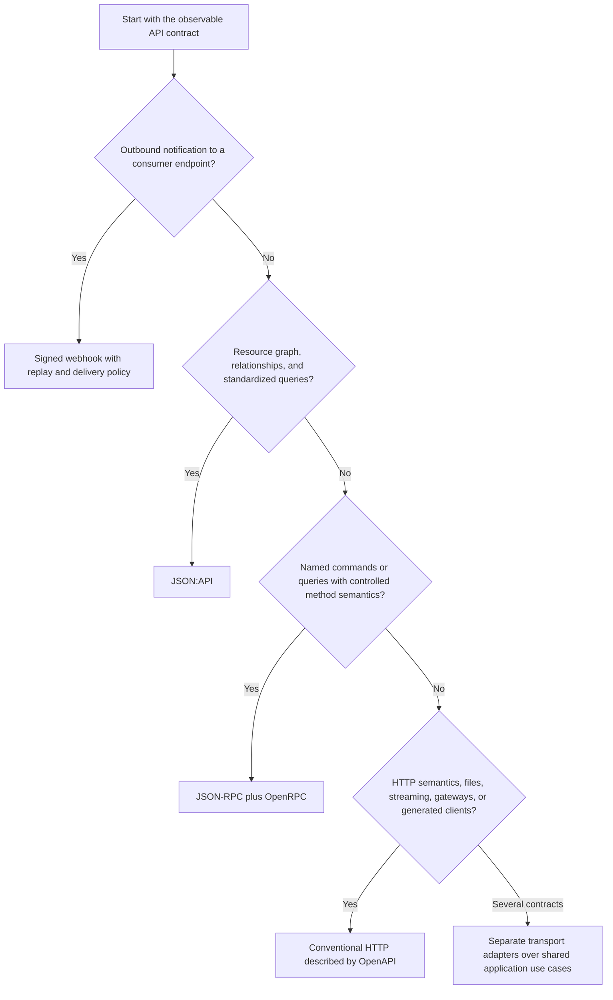

# API Protocols

Protocol choice follows the public operation and compatibility contract, not a
blanket rule that internal means RPC and external means REST.

## Decision Table

| Primary contract | Prefer | Main tradeoff |
| --- | --- | --- |
| Named commands and queries with controlled clients | JSON-RPC plus OpenRPC | HTTP ecosystem conventions are less direct |
| Resources, relationships, sparse fields, and compound documents | JSON:API | Action-heavy workflows can become unnatural resources |
| Conventional HTTP semantics, gateways, generated clients, files, or mixed media | Raw HTTP described by OpenAPI | More application-specific response and error conventions |
| Outbound asynchronous notification | Signed webhooks | Delivery is eventually consistent and requires replay controls |
| Multiple distinct audiences | Separate transports over shared application use cases | More adapters and compatibility surfaces to operate |

The flow identifies the dominant contract; it does not classify protocols by
whether callers are internal or external. When several branches are material,
use separate adapters instead of forcing one transport model across every
audience.

## JSON-RPC

Use `jsonrpc` for operation-oriented APIs with explicit method names, typed
command or query parameters, request correlation, notifications, or batches.
It is a common fit for service-to-service calls because clients are controlled,
but it can also serve public APIs whose contract is genuinely RPC-shaped.

Retries require method-level idempotency decisions; a transport retry is not
automatically safe. Notifications have no response contract. Batch members
retain independent validation and error semantics. `openrpc` describes and
discovers the method surface but does not replace runtime JSON-RPC validation.

Do not choose JSON-RPC solely to reduce routing code. Generic HTTP caching,
resource browsing, gateway policy, file transfer, and third-party REST tooling
may be more important than named methods.

## JSON:API

Use `jsonapi` when consumers benefit from standardized resources,
relationships, compound documents, sparse fieldsets, filtering, sorting,
pagination, profiles, extensions, and structured errors. Customer and partner
resource APIs are common fits; internal resource APIs can benefit equally.

The tradeoff is a more constrained document and query model. Complex include
graphs and sparse fields need explicit cost limits. Atomic Operations add a
transaction-like protocol contract and must match actual persistence
guarantees. Action-heavy workflows should not be disguised as resources merely
to retain one protocol.

## Raw HTTP And OpenAPI

Use conventional `net/http` endpoints when HTTP methods, status codes,
content negotiation, streaming, downloads, uploads, browser tooling, gateways,
or generated clients are first-class requirements. `openapi` describes this
surface; it is not a runtime serialization protocol and does not itself enforce
handler behavior.

## Webhooks And Events

Use `webhook` for outbound notifications to consumer-controlled HTTP endpoints.
Production delivery needs exact-byte signatures, timestamp tolerance, replay
protection, idempotent receivers, retries, dead-letter handling, and explicit
ordering expectations. Use a queue or event broker instead when both parties
control durable consumption and broker-level delivery semantics are required.

## Mixed Protocols

A service may expose JSON-RPC for internal commands, JSON:API or conventional
HTTP for external resources, and webhooks for outbound events. Share
application use cases and domain contracts, not transport request objects or
response models. Each adapter owns protocol validation and projection.

Continue with [recommended stacks](recommended-stacks.md) or return to the
[documentation index](index.md).
