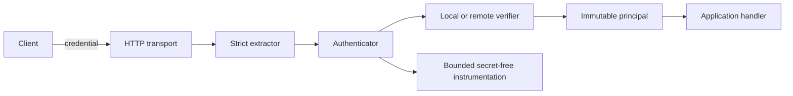
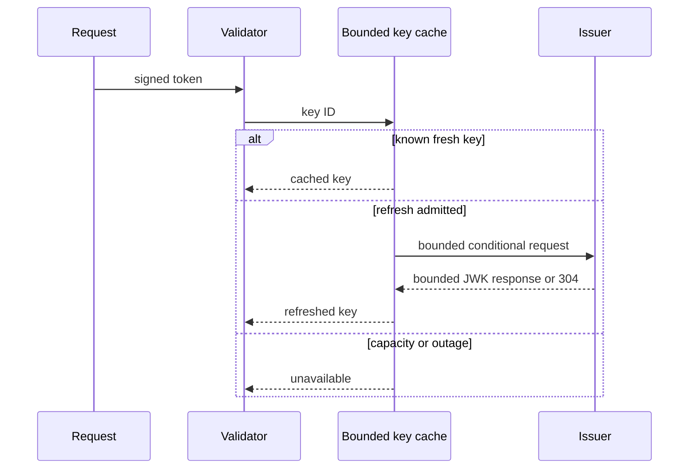

# Threat model

This library authenticates credentials and constructs immutable principals. It
does not authorize actions. Credentials, tokens, claims, key sets, issuer
responses, clocks, callbacks, and instrumentation are untrusted inputs.

## Credential flow

The transport, extractor, verifier, and application are separate trust
boundaries. TLS termination, reverse proxies, access logs, and application
authorization are deployment responsibilities outside this package.

Query credentials cross URL, proxy, browser-history, and access-log boundaries
before extraction. The library never constructs a credential-bearing URL, and
query sources require explicit configuration, but it cannot erase disclosure
that occurred upstream. New designs should use authorization or dedicated
credential headers.

## Remote key flow

Remote responses are constrained by HTTPS and issuer identity, redirect
policy, response size, key count, algorithm/key metadata, freshness bounds,
refresh cooldowns, waiter capacity, request deadlines, and owned shutdown.
Known cached keys may remain available during a transient outage; unknown keys
fail closed.

## Threats and controls

| Threat | Control |
| --- | --- |
| Secret disclosure | Redacted credential formatting, secret-free failures and instrumentation, no URL construction |
| Timing comparison of static secrets | SHA-256 fixed-size digests and `subtle.ConstantTimeCompare` over bounded entry sets |
| Credential smuggling | Duplicate and multi-source rejection; strict header, query, and cookie parsing |
| Algorithm or key confusion | Explicit algorithm allow-lists plus JWK type, curve, use, operation, and validation checks |
| Replay or stale identity | Required issuer/audience and bounded `exp`, `nbf`, `iat`, `auth_time`, and optional nonce validation |
| Remote resource exhaustion | Body, key, waiter, interval, deadline, and redirect bounds; single-flight refresh |
| Shutdown races and leaks | Admission ownership, cancellation, draining, idempotent bounded close |
| Mutable authenticated state | Defensive copies and immutable principal accessors |

## Explicit non-goals

The package cannot protect compromised process memory or configuration,
plaintext transport selected by a caller, malicious validation callbacks,
credential replay permitted by application policy, secrets logged before this
package receives a request, or incorrect authorization after authentication.
