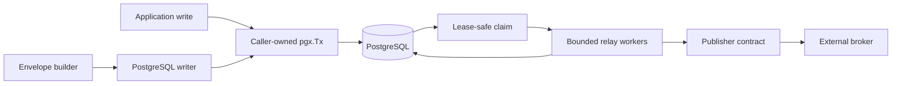
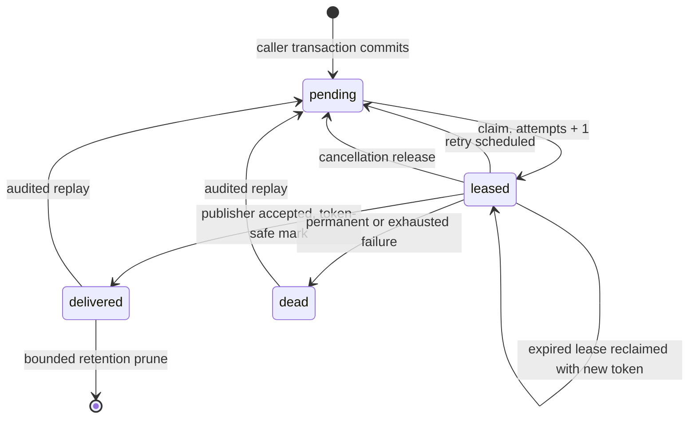

# Architecture And Recovery

## Components

Publisher adapters sit outside the core module. They cannot participate in the
application transaction and therefore cannot weaken or strengthen its atomic
persistence guarantee.

## State machine

Only `delivered` or `dead` rows can be pruned through their distinct retention
APIs. Replay is default-deny, accepts only authorized complete selections of
those terminal states, and rolls back if any requested ID is missing or
non-terminal.

## Crash and ambiguity matrix

| Crash or ambiguity point | Durable state | Recovery and delivery result | Deterministic evidence |
|---|---|---|---|
| Before application write | Nothing | Nothing is publishable. | Canceled/rolled-back writer transaction cases |
| After application write, before outbox insert | Neither write survives rollback | Caller owns the single transaction; writer never opens another. | Writer connection-loss-before-insert and caller-panic cases |
| During single or batch outbox insert | All statement rows or none | Any writer error requires rollback of the application transaction. | Rollback and batch constraint regressions |
| Writer receives a different transaction | Outbox and application state commit independently | This is outside the atomicity guarantee; callers must pass the exact transaction used for application writes. | Live two-transaction 0/1 mismatch regression |
| After outbox insert, before commit | Neither write survives rollback or connection death | Caller retries the whole application command according to its idempotency policy. | Connection-loss-before-commit case |
| During commit | Both become durable or neither is visible; client result can be ambiguous | Inspect application identity and outbox ID before retrying an ambiguous command. | Aborted commit, SQLSTATE `40001`, SQLSTATE `40P01`, and terminated-backend cases |
| After commit, before claim | `pending` | Any relay can claim it. | Live pending-to-claim state machine |
| During claim statement | PostgreSQL commits all lease changes or none | Uncommitted locks disappear; committed leases recover after expiry. | Timeouts `55P03`/`57014`, SERIALIZABLE, fairness, and four-process contention |
| Database endpoint outage or restart | Previously committed state remains in PostgreSQL; in-flight client operations fail or are ambiguous | Readiness fails during outage; infrastructure refreshes the primary route, then the relay resumes pending work. | Container stop/start, endpoint refresh, readiness recovery, and pre-outage record delivery |
| After claim, before publish | `leased` | Graceful cancellation releases it; process death relies on lease expiry. | Actual child-process exit, new-token reclaim, stale-token rejection, and cancellation cases |
| During publisher call | `leased`; publisher result can be unknown | Lease expiry or durable retry republishes; possible acceptance becomes a duplicate. | Blocking cancellation and accepted-then-timeout duplicate case |
| During lease renewal | Existing lease remains until its deadline | Renewal failure or heartbeat panic cancels publication and performs no stale transition; expiry permits reclaim. | Heartbeat failure/panic/cancellation and stale-token cases |
| Publisher panics | `leased` | Panic becomes payload-safe `ErrPublisherPanic` and follows normal failure policy. | Unit and live PostgreSQL durable-retry regressions |
| Classifier panics or returns an invalid class | `pending` after retry commit | Relay uses transient policy and returns a payload-safe policy error. | Unit and live PostgreSQL policy matrix |
| Backoff panics or returns an invalid delay | `pending` after retry commit | Relay uses zero or the one-minute maximum and returns a safe policy error. | Unit and live PostgreSQL policy matrix |
| Relay or store diagnostic clock panics | Normal durable transition | Clock output is diagnostic only; panic containment substitutes zero time and the operation continues. | Unit and live PostgreSQL delivery/prune regressions |
| After publisher acceptance, before delivered update | `leased` | Lease expiry republishes it. Duplicate delivery is expected. | Injected delivered-update failure and reclaim |
| During delivered update or commit | `leased` or `delivered`; client result can be unknown | If leased, it republishes after expiry; if delivered, normal claims exclude it. | Canceled transition matrix and duplicate-window regression |
| After delivered commit | `delivered` | Only an authorized replay can publish it again. | Delivered-state exclusion and replay tests |
| During retry, dead-letter, release, or extension | Old or new state atomically | Old lease expires/reclaims; committed new state follows its normal path. Retry delay is relative to the PostgreSQL clock. | Canceled transition matrix and +24-hour host-skew regression |
| Before replay authorization | Terminal original state | Default denial or hook failure makes no database change and writes no audit. | Default-deny and panic-contained authorizer regressions |
| During replay before commit | Terminal original state | Transaction rollback preserves the complete selection and writes no audit; detached cleanup is capped at five seconds. | Canceled/conflicting replay and bounded-rollback cases |
| After replay commit | `pending` plus immutable audit | Duplicate-producing operator intent is durable and inspectable. | Live replay/audit case |
| During archive callback | Terminal original state and row lock | Error or panic rolls back with five-second bounded cleanup; ambiguous archive success can repeat by envelope ID. | Archive error/panic, bounded rollback, and operator-race cases |
| During delivered/dead prune | Terminal row or deletion atomically | Pending and leased rows are never selected; strict cutoff uses `<`. | Cutoff-boundary, lock-skip, long-snapshot, and VACUUM cases |

An ambiguous database response is not evidence that a transaction failed.
Operators must inspect durable state before forcing replay or repeating manual
actions.

The PostgreSQL integration suite deterministically cancels the context before
claim, lease extension, delivered, retry, dead-letter, release, replay, and
prune transitions. It also injects connection death, serialization failure,
deadlock, publisher timeout after possible acceptance, delivered-update
failure, hook panics, read-only routing, long snapshots, and concurrent
operator/process races. `make recovery POSTGRES_VERSION=18` reruns the complete
exercise without application or production infrastructure.

## Bounds

Envelope field sizes, claim batches, administrative batches, lease duration,
relay batch size, workers, attempts, polling, transition cleanup, and retry
delay are bounded. Store and relay batches cannot exceed 1,000, workers cannot
exceed 256, attempts cannot exceed 10,000, and leases cannot exceed 24 hours.
Default and injected retry policies cannot exceed one minute; the default uses
capped exponential backoff with full jitter.

## Threat boundaries

- Lease tokens prevent stale-owner mutation but are not authentication tokens.
- Replay requires explicit IDs, requester, reason, and approval from the
  configured default-deny `ReplayAuthorizer`. The application owns identity,
  tenant, and policy evaluation inside that hook.
- Payloads and metadata are stored in PostgreSQL and sent to publishers. They
  must be treated as sensitive application data and must not be logged.
- A poison payload can repeatedly fail until maximum attempts moves it to
  `dead`; operators should inspect metadata and errors without disclosing the
  payload.
