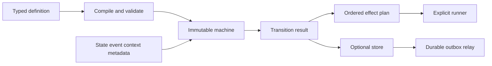

# Architecture and diagrams

The library separates pure selection from every side effect:

The root package imports no database or queue implementation. `memory`,
`postgres`, `runner`, `outbox`, and `diagram` depend on the root contract, not
the reverse.

## Selection rules

For a non-terminal current state, selection checks the exact `(state, event)`
transition first. If none exists, it checks the single wildcard transition for
the event. Compile rejects duplicate exact matches and duplicate wildcard
matches. Guard rejection does not fall through from an exact transition to a
wildcard.

All guards on the selected transition run in definition order. The first
rejection stops selection. A successful transition returns exit effects,
transition effects, then entry effects. A self-transition follows the same
external-transition sequence; it does not silently suppress exit or entry.

## Unsupported semantics

There are no hierarchical states, parallel regions, history pseudo-states,
timers, nested dispatch, or implicit reentrancy. Applications must not emulate
them with hidden callbacks. Add such semantics only through a future complete,
documented model.

Use `machine.Graph()` with `diagram.Renderer` to generate definition-specific
Mermaid or Graphviz documentation in stable definition order. Use the checked
export methods for serialized or otherwise untrusted graph imports; they reject
unknown references and bound graph shape, labels, and output bytes.
